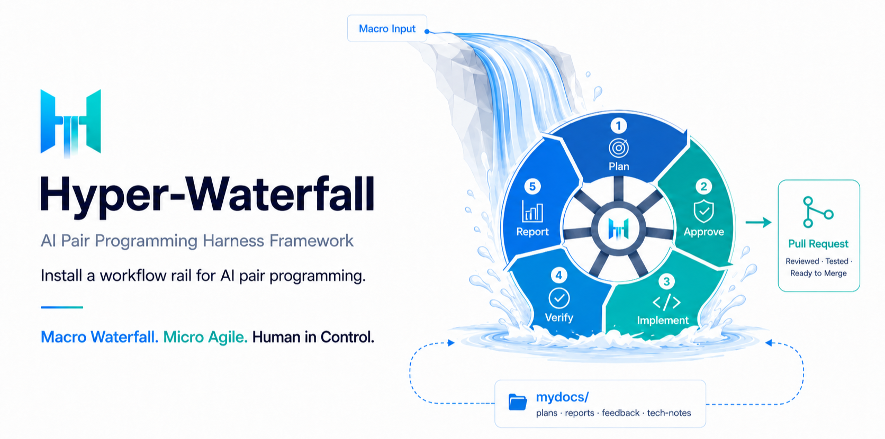

# Hyper-Waterfall

[English](README.md) | [한국어](README.ko.md) | 简体中文



## 将 AI 结对编程转化为可追踪、可审批开发流程的方法论

Hyper-Waterfall 不是把任务丢给 AI 然后说“直接做吧”的方式。它把 AI 的执行速度放进人的计划、审批、验证和报告纪律之中，让快速实现和可追踪开发流程同时成立。

核心很简单：**AI 负责执行，人负责决定方向。** 工作会经过 Issue、branch、计划书、Stage 报告、最终报告和 PR，每个阶段边界都有审批门。

| Hyper-Waterfall 核心 | 含义 |
|---|---|
| 人保留决策权 | 方向、范围、质量和架构决策始终由人掌握。 |
| 审批门 | 在源码修改、阶段切换、最终报告、PR 创建之前由人确认。 |
| 工作记忆外部化 | 上下文不只留在聊天里，而是沉淀到 Issue、计划书、报告、PR 和 commit log。 |
| 分阶段执行 | 大任务被拆成 Stage，每个 Stage 都经过验证和报告。 |
| 可恢复流程 | 新的 AI 会话或新贡献者可以只读仓库文档就从同一上下文继续。 |

> [!IMPORTANT]
> **可以把执行交给 AI，但不要把决策权交出去。**
>
> Hyper-Waterfall 不是让 AI 神奇地做到一切的工具，而是在 AI 快速工作时防止人失去方向的工作轨道。

## 为什么选择 Hyper-Waterfall？

AI 的弱点不是执行力不足，而是可能丢失上下文，或者在错误方向上高速前进。Hyper-Waterfall 把这个弱点转化为工作约束，并把 AI 的速度放进人可以审查的开发流程里。

| 强点 | 含义 |
|---|---|
| 知识资产化 | 工作意图、计划、验证结果、决策依据会留在 `mydocs/`、Issue、PR、commit log 中，成为下一次任务的输入。 |
| 风险提前发现 | 在执行计划书、实现计划书、Stage 完成报告边界都由人确认方向，减少大实现完成后才发现方向错误的情况。 |
| 自动化角色分工 | 人决定方向、优先级、质量和架构，AI 承担探索、实现、验证、文档化等重复性工作。 |
| 轻量上下文 | 以 `1 Issue = 1 Task = 1 Branch = 1 Session` 保持会话很小，把记忆留在仓库文档里。 |
| 提示指南对齐 | 清晰目标、充分上下文、输出格式、验证标准、停止条件都由仓库结构和模板固定。 |

Hyper-Waterfall 是一种方法论 harness，它把 AI 编码绑定到 Issue、branch、计划书、Stage 报告、最终报告和 PR，从而形成可追踪、可审批的开发流程。

它不会让 AI 立刻改文件，而是先文档化任务目的、范围和验证标准。在源码修改、阶段切换、最终报告、PR 创建之前，都有任务指示者的审批门。

结果是，所有工作都会被文档化，决策和验证结果会留在仓库里。即使聊天上下文消失，也能重新追踪任务意图和进度；其他 AI 会话或其他工作者也能在相同上下文中接手。

## 快速开始

### 现有仓库

把下面这一行发送给你的 AI 编码工具。

```text
将 https://github.com/postmelee/hyper-waterfall 的 Hyper-Waterfall 方法论应用到这个仓库。
```

### 新项目

当你的项目想法准备进入仓库时，先创建一个空的 GitHub 仓库或本地仓库。然后从这个空仓库发送下面的 prompt。

```text
我想在这个空仓库中开始一个新项目。

请先将 https://github.com/postmelee/hyper-waterfall 的 Hyper-Waterfall 方法论应用到这个仓库。

如果附带了项目简报或需求草案，请只把它作为上下文参考。不要在应用阶段创建产品计划、架构文档或源代码。应用完成后，请帮我把第一个产品任务注册为单独的 GitHub Issue。
```

在两种路径中，AI 都会先阅读 [`docs/agent-entrypoint.zh-CN.md`](docs/agent-entrypoint.zh-CN.md)，并按应用流程执行。在修改源码前，它必须先请求任务指示者批准。

| AI 需要先报告的内容 | 内容 |
|---|---|
| 应用模式 | 是新应用 Hyper-Waterfall，还是更新已有 Hyper-Waterfall 安装。 |
| 变更候选 | 会创建或修改哪些文件，是否需要 placeholder 替换。 |
| 审批请求 | 实际文件变更前，任务指示者需要批准的范围。 |

### 语言支持

默认 locale 是 `en`。支持的 locale pack 是 `en`、`ko`、`zh-CN`；如果所选 locale source 缺失，会先报告 fallback 候选，而不是静默替换。

| 语言 | Locale |
|---|---|
| English | `en` |
| 韩语 | `ko` |
| 简体中文 | `zh-CN` |

使用 AI 编码工具导入 Hyper-Waterfall 时，请复制 prompt。想在终端中不安装 CLI、只运行 lifecycle 判断时，请使用 `npx` dry-run。

#### English

```text
Apply the Hyper-Waterfall methodology from https://github.com/postmelee/hyper-waterfall to this repository. Use locale en.
```

```sh
npx hyper-waterfall@0.3.0 init --repo . --locale en --dry-run
```

#### 韩语

```text
https://github.com/postmelee/hyper-waterfall 의 하이퍼-워터폴 방법론을 이 저장소에 적용해줘. locale은 ko로 사용해줘.
```

```sh
npx hyper-waterfall@0.3.0 init --repo . --locale ko --dry-run
```

#### 简体中文

```text
将 https://github.com/postmelee/hyper-waterfall 的 Hyper-Waterfall 方法论应用到这个仓库。使用 zh-CN locale。
```

```sh
npx hyper-waterfall@0.3.0 init --repo . --locale zh-CN --dry-run
```

在 macOS 上，如果经常运行 CLI，可以通过 Homebrew 安装。

```sh
brew install postmelee/tap/hyper-waterfall
hyper-waterfall init --repo . --locale zh-CN --dry-run
```

`npx` 和 Homebrew CLI 命令只输出 lifecycle 判断。实际文件变更仍然必须经过审批 workflow。

导入后，AI 会按照 Hyper-Waterfall 方式推进工作。第一次使用时，你可以直接用自然语言告诉 AI，例如 `"请实现这个功能"`。

> 任何人都可以把 Hyper-Waterfall 应用到 GitHub 仓库，并让 Codex、Claude Code 等多个 AI 编码 agent 在同一套纪律下工作。

## 进一步了解 Hyper-Waterfall

[适用场景](#适用场景) ·
[与传统 AI 编码方式比较](#与传统-ai-编码方式比较) ·
[会发生什么变化](#会发生什么变化) ·
[Hyper-Waterfall 的强点](#hyper-waterfall-的强点) ·
[导入后的工作流](#导入后的工作流) ·
[生成的结构](#应用后的目标仓库结构生成的结构)

## 适用场景

Hyper-Waterfall 的重点是在 AI 快速修改代码时，让人不失去控制权和可追踪性。

| 适合的情况 | 不适合的情况 |
|---|---|
| 你会让 AI 编码工具修改真实源码，但希望变更范围和质量标准由人批准。 | 一两行修改，计划书和报告成本比变更本身还大。 |
| 工作需要跨多天、多会话、多 agent 继续推进。 | 一次性原型，比可追踪性更看重即时试验。 |
| PR review 时需要马上看出改了什么、为什么改、如何验证。 | 不使用 GitHub Issue、branch、PR 流程的仓库。 |
| 想把大任务按 Issue、branch、Stage 拆分，尽早发现方向错误。 | 人不打算审查结果，只想直接接受 AI 输出。 |
| 新贡献者或新 AI 会话需要只读仓库文档就能在同一上下文重启。 | 个人实验，不重视交接或可恢复性。 |

> 它最适合让 AI 实际修改源码，同时人必须持续控制方向和质量的工作。相反，如果即时试验比可追踪性更重要，它可能过重。

## 与传统 AI 编码方式比较

核心不是把决策权交给 AI，而是把 AI 的执行速度放进人的审批、审查和文档化纪律中。人决定方向和质量，AI 快速执行分析、实现、验证和文档化。

> 差异不在于是否使用 AI，而在于 AI 在什么边界内工作。普通 AI 编码依赖对话流，Hyper-Waterfall 把任务单位、审批点和产出格式固定在仓库里。

| 传统 AI 编码方式 | 应用 Hyper-Waterfall 后 |
|---|---|
| 说“做这个”，AI 立刻改文件。 | 先用 Issue 和执行计划书整理任务目的、范围、验证标准。 |
| 工作范围在对话中不断摇摆。 | 在实现计划书中按 Stage 拆分，只在批准范围内推进。 |
| 事后很难追踪 AI 为什么改了哪些文件。 | 通过阶段完成报告和 commit 记录变更原因、产出物、验证结果。 |
| 聊天变长后上下文变模糊。 | 将工作记忆外部化到 `mydocs/`、Issue、PR、commit log。 |
| 大实现完成后才发现方向错误。 | 在执行计划书、实现计划书、Stage 完成边界由任务指示者批准或要求修正。 |
| PR review 时需要重新翻聊天记录。 | 只看 PR 和报告就能确认改了什么、为什么改、如何验证。 |

人类任务指示者保留方向、质量、架构决策的完整所有权，而 AI 以人单独无法达到的速度和规模执行实现。

> [!IMPORTANT]
> **核心差异：人绝不停止思考。**

## 会发生什么变化

1. **AI 不会随意改代码。**
   源码修改前要经过计划书和审批门，因此任务指示者始终控制方向。

2. **人不会失去控制权。**
   源码修改、阶段切换、最终报告、PR 创建之前都有审批门。AI 执行，但方向和质量决策由人掌握。

3. **不用再从聊天记录里找“做到哪里了”。**
   Issue、今日待办、执行计划书、阶段报告、最终报告、PR 会自动构成工作时间线。

4. **聊天消失，工作记忆仍然留下。**
   意图、决策、验证结果会留在 `mydocs/`、Issue、PR、commit log 中。新会话、新 agent、新贡献者都能从同一上下文重启。

5. **按 task 工作，让上下文保持小而清晰。**
   推荐运用方式是 `1 Issue = 1 Task = 1 Branch = 1 Session`。task 结束，会话也结束；下一个 Issue 在干净的新会话中开始。

6. **可以并行运行多个 AI 会话。**
   独立 Issue 可以分别在 `local/task{N}` branch 或分离 worktree 中推进。上下文和变更范围不会混在一起。

7. **PR review 更容易。**
   PR 会整理改了什么、为什么改、经过哪些 Stage、做了哪些验证。reviewer 看仓库产出物，而不是聊天记录。

8. **减少大实现完成后才发现方向错误的情况。**
   执行计划书、实现计划书、Stage 完成报告都会成为由人审查的质量门。

9. **保留 vibe coding 的速度，同时恢复工程纪律。**
   可以快速构建，同时能解释构建了什么、追踪哪里出错、随时交接。

10. **AI 编码不再是“vibe”，而是可追踪的开发流程。**
    所有工作通过 Issue、branch、文档、commit、PR 连接起来，之后可以审查和交接。

## Hyper-Waterfall 的强点

AI 有两个结构性弱点。

- 会话变长或工具改变时，它会丢失上下文。
- 即使方向错了，也可能自信地继续执行。

本仓库把这些弱点转化为工作约束，并在下面四个轴上创造用户可以立即感受到的收益。

### 1. 每项工作都变成文档，文档又变成下一次工作的提示 — 知识资产化

- 工作意图、计划、各阶段验证结果、决策依据都会作为 markdown 文件沉淀到 `mydocs/`。它们不只是记录，而是**下一次工作的 input**。模型开始新 task 时，会读取同一仓库里的过去计划书、报告和决策记录，并在其上继续工作。
- 继续工作时，不依赖聊天历史，而是只用仓库产出物就能恢复上下文。新贡献者或新 AI 会话加入时，也能从同一个起点开始。

> 这和把 Obsidian vault 连接到 LLM、把个人知识库作为上下文使用的结构相同。差异在于 vault 的性质。Obsidian 收集一般知识和想法，而 `mydocs/` 是**专门面向工作历史的 vault**，按任务自动累积意图、计划、验证、产出物、故障排查。流程会强制执行，所以不容易遗漏，也保持一致。

### 2. 在大事故发生前，通过 gate 发现方向错误 — 风险

- 工作遵循 `Issue -> branch -> task plan -> implementation plan -> Stage implementation, verification, and report -> final report -> Open PR` 顺序，并在每个 gate 获得任务指示者批准。
- 不是等大实现完成后才意识到“方向错了”，而是在**执行计划书、实现计划书、每个 Stage 边界提前发现，因此沉没成本更小。**
- 如果阶段验证失败，就在该阶段内恢复；如果 scope 改变，就更新计划书并重新获得批准。

### 3. 不是“拜托 AI 做好”，而是“让 AI 在结构上更容易做好” — 自动化角色分工

- 任务指示者始终负责**方向、优先级、架构、质量决策**，AI 承担探索、草案、实现、测试、报告、PR 正文草拟等高重复工作。所有阶段切换都需要任务指示者明确批准。
- 本仓库在**运营层面自动化**这种分工。task 管理规则被拆成 SKILL，让 AI 自然遵守每一步要做什么、留下什么产出、何时停下并交回给人。
- 工作文档格式会自然满足 OpenAI 和 Anthropic 官方提示指南的核心。用户不需要单独学习提示工程，AI 就会在一致的中央模板、明确上下文、阶段性思考、固定输出格式中工作。

### 4. 以 task 为单位打开和关闭会话 — 轻量上下文

- Hyper-Waterfall 不是把所有工作上下文一直堆在一个 AI 会话中。推荐运用方式是 **`1 Issue = 1 Task = 1 Branch = 1 Session`**。一个会话负责一个 Issue，该 task 结束时，会话也结束。
- 每个会话只读取当前 Issue、执行计划书、实现计划书、阶段报告和相关代码。旧对话或其他 task 的决定不会污染当前判断，因此**上下文保持小而清晰。**
- task 结束后，结果不是留在聊天里，而是留在 `mydocs/`、Issue、PR、commit log 中。下一个 task 即使从新会话开始，也能读仓库文档并在同一上下文上出发。
- 互相独立的 Issue 可以在多个 AI 会话中通过不同 `local/task{N}` branch 或分离 worktree 并行推进。但如果任务会碰同一文件或同一架构决策，应先确定顺序。

> AI 会话不一定越长越聪明，往往会变得更模糊。Hyper-Waterfall 让会话保持短小，把记忆留在仓库里。

### 5. 结果

这四点不是彼此独立的功能，而是一个工作循环。工作留下文档，方向错误在 gate 被过滤，人和 AI 的角色被分离，会话按 task 保持小而清晰。

结果是，AI 编码不再是一段长聊天，而是仓库中可追踪、可审查、可恢复的开发流程。

> [!NOTE]
> 这个结构与 OpenAI 和 Anthropic 官方提示指南强调的清晰指令、充分上下文、输出格式约束、验证标准、长期工作记忆、agentic workflow 控制原则一致。详细映射见 [提示指南对齐](#提示指南对齐)。

## 导入后的工作流

Hyper-Waterfall 以 **task** 为单位推进工作。

### Task 推进步骤

所有 task 都**严格**遵循下面的步骤。

```text
1. 确认或登记 GitHub Issue
2. 记录今日待办 (mydocs/orders/)
3. 创建 task branch (local/task{number})
4. 编写 task plan -> [任务指示者批准]
5. 编写 implementation plan -> [任务指示者批准]
6. 按 Stage 实现
7. 编写 Stage completion report -> [任务指示者批准]
8. 重复下一 Stage
9. 编写 final result report -> [任务指示者批准]
10. 更新今日待办状态
```

> 每个 `[approval]` 点都是质量门。代码 review 单独抓不到的**方向性错误**，会在文档 review 中被抓到。

详细流程以 [task workflow manual](templates/locales/zh-CN/mydocs/manual/task_workflow_guide.md) 为准。branch 和 PR 发布流程见 [Git workflow manual](templates/locales/zh-CN/mydocs/manual/git_workflow_guide.md)。

### 核心 SKILL 细节

| SKILL | 使用时机 | 主要产出物 |
|---|---|---|
| `task-register` | 新任务需要先创建 GitHub Issue 时 | 遵循 `task.yml` Issue Form 结构的 GitHub Issue、milestone/label 候选及选择理由 |
| `task-start` | 开始处理已批准的 Issue 时 | `local/task{N}` branch、今日待办行、基于 `task_plan.md` 的执行计划书 |
| `task-stage-report` | 一个 Stage 实现完成、进入下一阶段前 | 基于 `stage_report.md` 的阶段报告、阶段打包 commit、阶段验证结果 |
| `task-final-report` | 所有 Stage 完成、发布 PR 之前 | 基于 `final_report.md` 的最终报告、今日待办完成处理、Open PR |
| `pr-merge-cleanup` | PR 实际 merge 后立即使用 | close Issue、删除 `publish/task{N}` 远程 branch、清理本地 branch/worktree |
| `external-pr-review` | 审查外部贡献者 PR 时 | 基于 `external_pr_*` 模板的 `mydocs/pr/` 审查文档、验证结果、建议（merge/要求修改/close） |
| `todo` | 创建或更新今日待办板时 | 基于 `orders.md` 更新 `mydocs/orders/yyyymmdd.md` 表格 |

何时向用户显示每个 SKILL，遵循 [SKILL call display guide](templates/locales/zh-CN/mydocs/manual/task_workflow_guide.md)。PR 正文编写与验证结构遵循 [internal task PR guide](templates/locales/zh-CN/mydocs/manual/internal_pr_guide.md)，PR 创建命令和文档链接格式遵循 [PR command and link guide](templates/locales/zh-CN/mydocs/manual/pr_command_guide.md)。

文档结构和 manual 文档中立性标准不是独立 SKILL，而是通过 [document structure manual](templates/locales/zh-CN/mydocs/manual/document_structure_guide.md) 确认。

### Task Cycle

如果 Issue 已经存在，就跳过 `task-register`，直接进入 `task-start` 编写执行计划书。例如任务指示者说 `"处理 issue #17"` 时，AI 会确认 #17 的 milestone 和正文，然后创建 `local/task17`、今日待办和执行计划书。只有尚无 Issue 时，`task-register` 才会检查重复 Issue、milestone、label，并在创建前获得批准，然后创建 GitHub Issue。

每次阶段切换都需要任务指示者明确批准。

```text
0. Task 登记 -> `task-register`
   └─ AI: 检查重复 Issue、milestone、label 候选
   └─ 任务指示者: 批准创建 Issue
   └─ AI: 创建 GitHub Issue 后，请求批准进入 `task-start`

1. 执行计划书 -> `task-start`
   └─ 任务指示者: 指定现有 Issue，例如 "处理 issue #N"，或批准从刚创建的 Issue 开始
   └─ AI: 编写计划书（最少 3 个阶段，最多 6 个阶段）
   └─ 任务指示者: 审查 -> 批准或要求修改

2. 分阶段实现 -> `task-stage-report`（按阶段数量重复）
   └─ AI: 编写代码 + 运行测试
   └─ AI: 编写阶段完成报告
   └─ 任务指示者: 验证 -> 批准或反馈

3. 反馈反映 -> (manual)
   └─ 任务指示者: 编写反馈文档 (mydocs/feedback/)，AI 反映。如果 scope 改变，更新计划书并重新批准
   └─ AI: 反映反馈并修正

4. 最终报告 + Open PR -> `task-final-report`
   └─ AI: 编写最终结果报告，并创建结构化验证依据的 Open PR
   └─ 任务指示者: 验证 -> 批准或反馈

5. PR review + merge + 清理 -> `pr-merge-cleanup`
   └─ 任务指示者: PR review -> 批准或反馈
   └─ AI: review/merge 后 close Issue，清理 branch/今日待办
```

`todo` 会在上述流程中任何需要更新今日待办板的时点调用。`external-pr-review` 是外部贡献者 PR review 用的独立流程。

### 文档结构

task 使用或产生的文档结构：

```text
mydocs/
├── _templates/                         <- 各类产出物的输出格式
├── orders/yyyymmdd.md                  <- 今日待办（task 列表 + 状态）
├── plans/task_{milestone}_{N}.md       <- 执行计划书
├── plans/task_{milestone}_{N}_impl.md  <- 实现计划书
├── working/task_{milestone}_{N}_stage{S}.md
│                                        <- Stage 完成报告
├── report/task_{milestone}_{N}_report.md
│                                        <- 最终结果报告
├── feedback/                           <- 反馈与 review 意见
├── tech/                               <- 技术调查与正式化前草案
├── manual/                             <- 运营手册与重复工作标准
├── troubleshootings/                   <- 故障排查
└── pr/                                 <- 外部 PR review 记录
```

文件夹角色、文档文件名规则和产出物输出格式都在 [document structure manual](templates/locales/zh-CN/mydocs/manual/document_structure_guide.md) 中定义。每个文件夹的详细编写规则以该文件夹的 `README.md` 为准。

| 区域 | 策略 |
|---|---|
| `mydocs/` | 保存工作记忆、运营手册和调查依据。它不是目标项目的正式产品文档根目录。 |
| 正式产品文档 | Hyper-Waterfall 不固定正式文档根目录名称。目标项目可以选择 `docs/`、`specs/`、`site/`、`website/`、`adr/`、GitHub Wiki 等路径。创建、移动或修改产品/用户/贡献者/API/架构/路线图文档的 task，必须先在执行计划书的文档位置判断中说明目标读者、正式化级别、选择路径、替代路径、选择理由，并获得批准。 |
| `manual/` | 包含重复适用的运营标准和流程。特定 Issue、PR、release 验证、事故记录应分离到对应产出物文档。细节遵循 [manual document neutrality policy](templates/locales/zh-CN/mydocs/manual/document_structure_guide.md)。 |
| `tech/` | 包含技术调查、方案比较、设计判断依据和尚未正式化的草案。若要提升为用户或外部集成者必须遵循的正式契约文档，需要在单独 task 中选择正式文档根目录并获得批准。 |
| `_templates/` | 输出格式的 source of truth，不是实际 task 产出物。每个 Skill 生成产出物时先读取 `mydocs/_templates/` 中的相应模板，只有无法读取模板时才使用 Skill 内部的最小章节摘要作为 fallback。 |
| GitHub Issue 与 Pull Request | GitHub 平台产出物。Issue 正文以 `.github/ISSUE_TEMPLATE/task.yml` 为准，PR 正文以 `.github/pull_request_template.md` 为准，留在仓库内的工作文档以 `mydocs/_templates/` 为准。细节遵循 [GitHub platform template policy](templates/locales/zh-CN/mydocs/manual/document_structure_guide.md)。 |

## 应用后的目标仓库结构（生成的结构）

复制 `templates/` 并替换 placeholder 后，目标仓库会变成如下结构。

```text
your-repo/
├── AGENTS.md                       运营规则的单一 source of truth
├── CLAUDE.md                       Claude Code 用（引用 AGENTS.md）
├── .hyper-waterfall/
│   └── version.json                 记录已应用的 Hyper-Waterfall version 和 locale
├── .github/
│   ├── ISSUE_TEMPLATE/
│   │   └── task.yml
│   └── pull_request_template.md
├── .agents/
│   └── skills -> ../mydocs/skills  Codex 识别路径（符号链接）
├── .claude/
│   └── skills -> ../mydocs/skills  Claude Code 识别路径（符号链接）
└── mydocs/
    ├── _templates/         各类产出物的输出格式模板
    ├── manual/             运营手册（文档结构、task 流程、Git、PR、lifecycle、release/update、冲突规则）
    ├── skills/             SKILL source of truth（Codex/Claude Code 共用）
    ├── orders/             今日待办 (yyyymmdd.md)
    ├── plans/              执行/实现计划书
    │   └── archives/
    ├── working/            Stage 完成报告
    ├── report/             最终结果报告
    ├── feedback/           反馈与 review 意见
    ├── tech/               技术调查与正式化前草案
    ├── troubleshootings/   故障排查
    └── pr/                 外部 PR review 记录
        └── archives/
```

| 区域 | 提供什么 |
|---|---|
| `AGENTS.md`, `CLAUDE.md` | 将共同运营规则加载到 AI 编码 agent。`AGENTS.md` 是 source of truth，`CLAUDE.md` 委托给它。 |
| `.hyper-waterfall/version.json` | 记录已应用的框架 version 和所选 locale，并支持 update 判断。 |
| `.github/` | 固定 GitHub Issue Form 和 Pull Request 正文结构。 |
| `.agents/skills`, `.claude/skills` | 通过符号链接让 Codex 和 Claude Code 读取同一份 SKILL 文本。 |
| `mydocs/_templates/` | 固定计划书、报告、反馈、技术调查、故障排查、外部 PR review 的输出格式。 |
| `mydocs/manual/` | 存放重复适用的运营政策和流程。 |
| `mydocs/orders/`, `plans/`, `working/`, `report/` | 保存每日 task 状态、计划书、Stage 报告、最终报告。 |
| `mydocs/feedback/`, `tech/`, `troubleshootings/`, `pr/` | 保存反馈、调查、故障排查、外部 PR review 记录。 |

应用仓库中的 `.agents/skills` 和 `.claude/skills` 符号链接结构遵循 [Agent Skills location policy](templates/locales/zh-CN/mydocs/manual/document_structure_guide.md)。`.hyper-waterfall/version.json` 和 manifest 基准 update 流程整理在 [distribution manifest and version record policy](templates/locales/zh-CN/mydocs/manual/document_structure_guide.md)、[`docs/lifecycle/update.zh-CN.md`](docs/lifecycle/update.zh-CN.md)、[`docs/lifecycle/update_pr.zh-CN.md`](docs/lifecycle/update_pr.zh-CN.md) 中。

框架的文档模板、GitHub Issue Form、SKILL source of truth 分别位于 `templates/mydocs/_templates/`、`templates/.github/ISSUE_TEMPLATE/task.yml`、`templates/mydocs/skills/`。在应用仓库中，`.agents/skills` 和 `.claude/skills` 符号链接会指向同一个 `mydocs/skills` 正文。

## 维护者细节

<details>
<summary><strong>更新已有应用仓库</strong></summary>

已有应用仓库的更新基于 GitHub Release/tag 和 manifest 执行。AI 以 [`docs/agent-entrypoint.zh-CN.md`](docs/agent-entrypoint.zh-CN.md) 为入口，按照 [`docs/lifecycle/update.zh-CN.md`](docs/lifecycle/update.zh-CN.md) 的既有更新判断结果格式，先报告当前 version、当前 locale、requested locale 或 switch request、目标 release/tag、目标 release locale support、migration guide、manifest diff、locale manifest diff、Hyper-Waterfall version update PR 候选。

将已批准的 update 候选转换为 PR 时，遵循 [`docs/lifecycle/update_pr.zh-CN.md`](docs/lifecycle/update_pr.zh-CN.md)。npm CLI 是让同一判断更容易执行的便利渠道，不替代 canonical 基准：GitHub Release/tag、`templates/manifest.json`、migration guide。不会只凭 CLI 输出自动应用文件，而是只把已批准范围转换为普通 task flow。

</details>

<details>
<summary><strong>CLI 与发布渠道</strong></summary>

`hyper-waterfall` CLI 通过 npm 分发，可使用固定 version 的 `npx` 命令执行 lifecycle 判断。`v0.3.0` release 状态和发布后验证结果在 [`docs/releases/v0.3.0.md`](docs/releases/v0.3.0.md) 中管理。

```bash
npx hyper-waterfall@0.3.0 init --repo . --dry-run
npx hyper-waterfall@0.3.0 update --repo . --from v0.2.0 --to v0.3.0 --dry-run
npx hyper-waterfall@0.3.0 doctor --repo .
```

macOS 可以通过 Homebrew public tap 安装 CLI。

```bash
brew install postmelee/tap/hyper-waterfall
hyper-waterfall --version
hyper-waterfall doctor --repo .
```

Homebrew、Docker、Codex plugin、Claude plugin 等其他发布渠道，也只被视为协议执行手段，不替代 canonical 基准。各渠道的目的、非目标、运营成本和优先级整理在 [`docs/distribution-channels.md`](docs/distribution-channels.md) 中。

这个 Homebrew formula 是安装 npm CLI 的 wrapper，不替代 canonical 基准：GitHub Release/tag、`templates/manifest.json`、migration guide。Homebrew 可以把 Node runtime 作为依赖安装。不指定 tap 的 `brew install hyper-waterfall` 路径需要进入 Homebrew core，但根据 [#46](https://github.com/postmelee/hyper-waterfall/issues/46) 的审查标准，目前保留 public tap 路径，不提交到 core。

</details>

---

## 附录

**Part 1. 最初的 Hyper-Waterfall** ([rhwp](https://github.com/edwardkim/rhwp))

1. [什么是 Hyper-Waterfall？](#什么是-hyper-waterfall)
2. [核心结构](#核心结构)
3. [核心原则](#核心原则)
4. [角色分工](#角色分工)
5. [Vibe Coding vs Hyper-Waterfall](#vibe-coding-vs-hyper-waterfall)
6. [为什么强大 — AI 让人到达原本到不了的地方](#为什么强大--ai-让人到达原本到不了的地方)

**Part 2. postmelee/hyper-waterfall**

1. [postmelee/hyper-waterfall：将方法论做成 harness](#postmeleehyper-waterfall将方法论做成-harness)
2. [活的示例 — 自己跟着看](#活的示例--自己跟着看)
3. [设计原则](#设计原则)
4. [提示指南对齐](#提示指南对齐)
5. [许可证](#许可证)

---

## 什么是 Hyper-Waterfall？

### 宏观 Waterfall + 微观 Agile：AI 让两者可以同时成立

这是 AI 出现之前无法成立的方法论：同时拥有 waterfall 的纪律和 agile 的速度。

> 这个方法论基于 [`edwardkim/rhwp`](https://github.com/edwardkim/rhwp) 和 [`postmelee/alhangeul-macos`](https://github.com/postmelee/alhangeul-macos) 等真实项目经验被提炼出来。
> 其核心哲学最完整地整理在 [edwardkim/rhwp · hyper_waterfall.md](https://github.com/edwardkim/rhwp/blob/main/mydocs/manual/hyper_waterfall.md)。本仓库把该方法论模块化，使其可以轻松应用到其他仓库。

如果想先理解方法论，请从 [核心结构](#核心结构) 开始；如果只想看本仓库的差异点，请跳到 [postmelee/hyper-waterfall：将方法论做成 harness](#postmeleehyper-waterfall将方法论做成-harness)。

## 核心结构

### 宏观 Waterfall + 微观 Agile

```text
宏观（项目层面）— waterfall 的纪律：
  计划 ──→ 设计 ──→ 实现 ──→ 验证 ──→ 发布
   │       │       │       │       │
   ▼       ▼       ▼       ▼       ▼
  文档化   文档化   文档化   文档化   文档化

微观（task 层面，数小时）— agile 的速度：
  实现 ──→ 测试 ──→ 反馈 ──→ 修改 ──→ 测试 → ...（快速迭代）
   │       │       │       │       │
  AI      自动化    人判断    AI      自动化
```

- 宏观方向用 **waterfall 的纪律**控制：计划书、审批、阶段报告、最终验证。
- 微观执行用 **agile 的快速迭代**推进：让 AI 和即时反馈循环运转，整个周期在**数小时**内完成。

在这个过程中，所有工作都会文档化，所有决策都会被记录。这就是 Hyper-Waterfall 得以成立的原因。

## 核心原则

> **人绝不停止思考。**

无论 AI 多么优秀，决定方向和判断质量的都是人。不阅读 AI 输出就接受的瞬间，Hyper-Waterfall 就会退化成 vibe coding。把这个原则落到运营层面，就是下面三点。

### 1. 人把方向掌握到最后

阶段切换、计划变更、源码修改都需要任务指示者明确批准。AI 是决策的工具，不是决策者。只要开始跳过 gate，方法论就会快速崩塌。

### 2. 始终给 AI 足够上下文

为了不在每次 prompt 中从头说明任务意图、范围和批准标准，意图和计划被写入 `mydocs/`。模型读取同一个仓库，在同一上下文上工作。如果在上下文分散的状态开始工作，AI 会用猜测填补空白。

### 3. 定期外部化 AI 的工作记忆

阶段报告、最终报告、PR 正文会提炼并记录意图、决策、验证依据。聊天上下文会消失，但仓库里的 markdown 会留下；新会话或新贡献者加入时，也能从同一起点开始。

## 角色分工

### 任务指示者（人）

人专注于**思考**：

- 方向设定：“下一步该做什么？”
- 优先级：“什么更重要？”
- 质量判断：“这是否足够好？”
- 架构决策：“这个结构是否正确？”
- 领域知识：“这个领域里这种情况应该如何表现？”
- 反馈：“这部分错了，因为……”

### AI 结对程序员

AI 专注于**执行**：

- 分析：探索代码库、追踪原因
- 计划：编写实现计划书
- 实现：编写代码、生成测试
- 文档：报告、技术文档、commit message
- 调试：分析日志、提出修正方案
- 迭代：反映反馈、重试

## Vibe Coding vs Hyper-Waterfall

> Vibe coding — `不阅读 AI 输出就接受，让 AI 做架构决策，部署自己不理解的代码` — 是陷阱。表面上可能能运行，但因为你不理解结果，出问题时无法诊断。
>
> 本项目采取相反方法。人类任务指示者保留方向、质量、架构决策的完整所有权，AI 则以人单独无法达到的速度和规模执行实现。核心差异：**人绝不停止思考。**
>
> — [edwardkim/rhwp · Vibe Coding vs AI-Driven Development](https://github.com/edwardkim/rhwp#%EB%B0%94%EC%9D%B4%EB%B8%8C-%EC%BD%94%EB%94%A9-vs-ai-%EC%A3%BC%EB%8F%84-%EA%B0%9C%EB%B0%9C)

| | Vibe Coding | Hyper-Waterfall |
|---|---|---|
| **人的角色** | 接受 AI 输出 | 指示、审查、决定 |
| **计划** | 无 — “直接做” | 执行计划书 -> 批准 -> 实现计划书 -> Stage 单位执行 |
| **质量门** | 希望它能工作 | 每个 Stage 验证 + 审批门 + Open PR review |
| **调试** | 让 AI 修 AI 的 bug | 人诊断，AI 实现 |
| **架构** | 偶然形成 | 任务指示者有意设计 |
| **文档** | 无 | `mydocs/`（计划书、阶段报告、最终报告）+ Issue/PR 正文 |
| 可复现性 | 不可能 | 可追踪完整过程时间线 |
| **结果物** | 脆弱、难维护 | 可追踪、可交接、可在任何地方恢复 |

## 为什么强大 — AI 让人到达原本到不了的地方

宏观 waterfall 和微观 agile 长期以来是一种 trade-off。重视纪律就会变慢，重视速度就会失去纪律。AI 结对程序员出现后，这个 trade-off 第一次被打破。

### 1. 不失去速度，同时恢复纪律

waterfall 变重的一个主要原因是**人必须承担所有文档、计划和验证**。AI 能快速生成这些草案，因此可以同时恢复 waterfall 失去的速度和 agile 失去的纪律。**同样的纪律，100 倍速度** — 这是没有 AI 时到不了的地方。

### 2. 知识外部化到仓库，而不是留在脑中

决策、依据、验证结果都会留在 `mydocs/` 和 PR/Issue 中。即使集中在某个人身上的上下文消失，下一个人或下一个 AI 会话也能从**同一起点**开始。agile 的 bus-factor 问题因此被结构性缓解。

### 3. 人专注决策，AI 专注执行

人始终负责方向、优先级、架构和质量，AI 负责探索、实现、测试、文档和反复迭代。一个人的注意力无法覆盖的工作量，会进入一个周期内。**AI 是倍增器**。把它放在好的流程之上，就能得到非凡结果。

### 4. 可以在多个地点移动工作

[rhwp](https://github.com/edwardkim/rhwp) 的维护者会在办公室、家里、移动中三个地点，用不同的 Claude 会话工作。每个新会话都没有之前的记忆。

但有文档时：

| 问题 | 答案 |
|---|---|
| “现在该做什么？” | `orders/20260409.md` |
| “做到哪里了？” | `working/task_m100_86_stage1.md` |
| “决定怎么做来着？” | `plans/task_m100_86_impl.md` |
| “为什么用这个方式？” | `feedback/` + `tech/` |
| “这个坑是什么？” | `troubleshootings/` |

**任务指示者几乎不需要花时间传递上下文。** 这就是为什么可以在三个地点连续工作，也是贡献者加入时同样有效的原因。

---

## postmelee/hyper-waterfall：将方法论做成 harness

> 本仓库参考 [rhwp](https://github.com/edwardkim/rhwp) 中最初导入的 Hyper-Waterfall 方法论，并做了如下扩展。

### 1. 用一行 prompt 应用到任何仓库 — 模块化 + placeholder 替换

原始方法论（rhwp）与该仓库的文档和惯例强绑定，很难直接搬到其他项目。本仓库把运营规则、manual、SKILL 分离到 `templates/`，并用 [`docs/agent-entrypoint.zh-CN.md`](docs/agent-entrypoint.zh-CN.md) 固定入口流程。结果是，**只要给 AI 编码工具一行 prompt**，就可以应用到任何仓库。AI 会按入口流程自动替换 `REPO_SLUG`、`BASE_BRANCH` 等 placeholder。

已有应用仓库更新的 lifecycle 基准也整理成独立文档。GitHub Release/tag、manifest、migration guide、`.hyper-waterfall/version.json` 用来先判断当前 version、当前 locale、requested locale 或 switch request、目标 release/tag、目标 release locale support、manifest diff、locale manifest diff、Hyper-Waterfall version update PR 候选。细节见 [`docs/lifecycle/update.zh-CN.md`](docs/lifecycle/update.zh-CN.md) 和 [`docs/lifecycle/update_pr.zh-CN.md`](docs/lifecycle/update_pr.zh-CN.md)。本仓库本身就是把该方法应用到自己的第一个 dogfooding 案例（Issue #1, PR #2）。

### 2. 与官方提示指南对齐

工作文档格式被设计为自然满足 [OpenAI](https://developers.openai.com/api/docs/guides/prompt-guidance) 和 [Anthropic](https://platform.claude.com/docs/en/build-with-claude/prompt-engineering/claude-prompting-best-practices) 官方提示指南的核心。尤其是 GitHub Issue/PR 模板负责结构化 GitHub 平台产出物，`templates/mydocs/_templates/` 则明确计划书、报告、反馈、外部 PR review 文档的输出格式。

> 在 AI 编写文档、再读取并把文档作为 reference 使用的递归过程中，这能尽量减少回答质量下降。

- 清晰性（Clarity）：任务目标被明确定义。
- 一致性（Consistency）：所有工作文档拥有相同结构。
- 分步方式（Step-by-step thinking）：把工作拆成小阶段推进。
- 上下文（Context）：任务所需信息都包含在文档中。
- 输出格式约束（Output format）：任务结果按中央模板的特定格式输出。

详细映射见 [提示指南对齐](#提示指南对齐)。

### 3. Multi-agent 兼容 + 运营规则、SKILL、manual 分离带来的 token/context 效率

rhwp 把运营规则、文档结构、文件夹政策、命名规则、PR 处理都 inline 在一个 `CLAUDE.md` 文件中，且没有 `AGENTS.md`，因此是 Claude Code 专用。本仓库沿两个方向分离和扩展。

**(1) Multi-agent 兼容**：`AGENTS.md` 是单一 source of truth，`CLAUDE.md` 只用一行 `@AGENTS.md` 引用。SKILL 通过 `.agents/skills`（Codex）和 `.claude/skills`（Claude Code）符号链接，让两个工具识别同一正文。新的 SKILL 识别工具也可以用同一模式扩展。

**(2) 运营规则、SKILL、manual、template 分离**：`AGENTS.md` 只保留每轮系统 prompt 必须加载的政策、约束和索引。流程细节被分离到 [`mydocs/manual/`](templates/locales/zh-CN/mydocs/manual/) 下按主题拆分的 manual（文档结构、task 流程、Git、PR、lifecycle、release/update、冲突规则）、各 `mydocs/` 文件夹的 `README.md`、[`.github/`](templates/locales/zh-CN/.github/) 下的 GitHub Issue/PR 模板、[`mydocs/_templates/`](templates/locales/zh-CN/mydocs/_templates/) 下的文档输出格式、[`mydocs/skills/`](templates/locales/zh-CN/mydocs/skills/) 下的 7 个 SKILL。

效果：

- **token 效率**：减少每轮系统 prompt 加载的内容。manual 和 SKILL 正文只在调用时进入上下文。
- **context 效率**：模型只在需要时读取需要的流程。无关流程不会污染上下文。
- **意图传递清晰**：GitHub 模板和中央模板固定重复产出物结构，分阶段 SKILL 明确流程中何时调用，AI 不需要靠推断重建流程或输出格式。
- **模型间可移植性**：SKILL 是标准格式，容易移植到其他支持 SKILL 的工具。

## 活的示例 — 自己跟着看

本仓库本身就是把 Hyper-Waterfall 应用到自身的第一个案例。如果在决定是否应用前想看真实运营如何运转，可以按下面顺序查看。

1. **Issue** [`#1` Hyper-Waterfall self-adoption (dogfooding)](https://github.com/postmelee/hyper-waterfall/issues/1) — 3 个 label、milestone M010、linked PR 自动显示的清晰结构（没有状态通知噪音评论）
2. **Pull Request** [`#2`](https://github.com/postmelee/hyper-waterfall/pull/2) — Open PR 正文格式：4 个摘要 bullet（目标 task/为什么/做了什么/review point）、Stage 5 个 timeline 双链接（阶段报告 + commit URL）、影响区域表、工作文档、验证结果和依据
3. **执行计划书** [`mydocs/plans/task_m010_1.md`](mydocs/plans/task_m010_1.md) — 目的、背景、范围、设计方向、预计变更文件、暂定阶段、验证计划、风险
4. **5 阶段实现计划书** [`mydocs/plans/task_m010_1_impl.md`](mydocs/plans/task_m010_1_impl.md) — 预先确定阶段产出物、验证命令、commit message
5. **5 个阶段报告** [`mydocs/working/`](mydocs/working/) — 每个 Stage 结束时的产出物、验证结果、残余风险、下一阶段影响
6. **最终报告** [`mydocs/report/task_m010_1_report.md`](mydocs/report/task_m010_1_report.md) — 5 阶段综合、变更前后定量比较、验收标准验证
7. **今日待办** [`mydocs/orders/`](mydocs/orders/) — 日板格式（按 milestone 分表 + 完成时间）
8. **commit log** [`git log` (main)](https://github.com/postmelee/hyper-waterfall/commits/main) — 从第一个 task commit 到 `pr-merge-cleanup`，12 个 task commit 按时间顺序保留

第一个 task 经历了两次 scope 扩展，并以 5 个阶段推进。也就是说，README 中写的流程如何实际运转 — 审批门、阶段报告、scope 变更处理、PR 正文重写、merge 后清理 — 都可以通过活的产出物跟踪。

## 设计原则

- 有意义的源码变更需要人工审批门。
- Issue 进展追踪委托给 GitHub 的 linked PR 自动 cross-reference、label 和 milestone；评论只用于讨论、blocker、决策记录。
- 最新状态应该能从 Issue metadata、当前 branch 或 PR、`mydocs/` 找到。
- 这个框架必须适用于多种项目类型。特定语言、构建、发布、产品规则应放在目标仓库的模板和设置中，而不是 core 中。
- 对流程严格，对工具灵活。

> Hyper-Waterfall 不是新魔法，而是在 AI 这个倍增器之上，同时保留 waterfall 的纪律和 agile 的速度的运营方式。在好的流程之上，AI 能产出非凡结果。

## 提示指南对齐

Hyper-Waterfall 在开发流程层面实现了 OpenAI 和 Anthropic 官方提示指南的核心。它不是“如何写好 prompt”，而是创建一种**prompt 自然会被写好的仓库结构**。

### 对齐摘要

| 原则 | Hyper-Waterfall 中的实现方式 | 效果 |
|---|---|---|
| 清晰目标 | GitHub Issue、执行计划书、实现计划书 | AI 先理解工作范围和成功标准。 |
| 充分上下文 | `mydocs/` 中的计划书、报告、反馈、技术调查 | 新会话也能通过仓库文档恢复上下文。 |
| 输出格式约束 | `mydocs/_templates/`、Issue/PR template | 计划、报告、验证结果每次都按相同结构留下。 |
| 分阶段推进 | Stage 单位实现、验证、报告 | 复杂工作被拆成可 review 单位。 |
| 验证标准 | Stage 报告、最终报告、PR 正文 | 结果不是凭感觉判断，而是依据记录的标准。 |
| 停止条件 | 审批门 | AI 不会任意进入下一阶段。 |
| 长期工作记忆 | `mydocs/`、commit log、PR timeline | 聊天消失后工作历史仍然保留。 |
| 轻量上下文 | `1 Issue = 1 Task = 1 Branch = 1 Session` | 会话保持小而清晰。 |

<details>
<summary><strong>OpenAI prompt guidance 映射</strong> · 来源: <a href="https://developers.openai.com/api/docs/guides/prompt-guidance">OpenAI prompt guidance</a></summary>

1. **先确定产出物。**
   Hyper-Waterfall 从任务开始就明确 Issue、执行计划书、实现计划书、Stage 报告、最终报告、PR 这些产出物。不是让 AI “做好一点”，而是先固定必须留下什么。

2. **写明好回答的标准。**
   每个 Stage 不只留下实现，也留下验证标准和 review point。因此 AI 结果不是凭感觉评价，而是在文档化标准上判断。

3. **设置简短约束。**
   Hyper-Waterfall 明确 AI 不应越过的边界，例如“不经批准不得进入下一 Stage”“源码修改前先批准”“按 Issue 追踪”。这不是消除自由度，而是铺设防止失控的轨道。

4. **说明需要的依据层级。**
   实现结果会被提炼成 Stage 报告、验证日志、PR 正文。仓库里留下的不只是代码变更，还有为什么变更、如何确认。

5. **指定输出格式。**
   `mydocs/_templates/` 固定执行计划书、实现计划书、阶段报告、最终报告、反馈、技术调查、故障排查、外部 PR review 文档的 expected output shape。PR 正文由 `.github/pull_request_template.md` 按 review 画面结构化。AI 的回答不再散乱，而是成为下一个工作者能再次阅读的结构。

6. **告诉模型何时停止。**
   Hyper-Waterfall 在每个 Stage 边界停止，并等待人的批准。AI 不是一路跑到底，而是在可以由人确认方向的停止线前停下。

</details>

<details>
<summary><strong>Anthropic Claude prompting best practices 映射</strong> · 来源: <a href="https://platform.claude.com/docs/en/build-with-claude/prompt-engineering/claude-prompting-best-practices">Claude prompting best practices</a></summary>

1. **清晰直接的指令。**
   任务意图通过 Issue、执行计划书、实现计划书在每个阶段被明确化。不是把模糊意图丢给模型，而是在 gate 前固定要做什么、为什么做、做到哪里。

2. **提供 workflow 和目标上下文。**
   用户不需要每次 prompt 都说明工作属于哪个流程、结果物放在哪里。`mydocs/`、Issue、PR 正文中已经嵌入这些上下文，模型会自然读取同一上下文。

3. **顺序化步骤。**
   Stage 单位推进和每阶段审批门，直接实现了把指令拆成顺序步骤的建议。

4. **控制输出格式。**
   执行计划书、阶段报告、最终报告、反馈、技术调查、外部 PR review 文档遵循 `mydocs/_templates/` 的 desired output format，PR 正文遵循 `.github/pull_request_template.md`。模型不需要每次发明“哪里写什么”。

5. **长期工作与外部记忆。**
   `mydocs/` 直接对应 long-horizon agentic work 和 memory task。即使聊天上下文消失，工作记忆也会被提炼并留在文件系统中。

6. **Literal 指令遵循与对齐。**
   更 literal 的模型往往更准确地绑定到明确范围。Hyper-Waterfall 先把“源码修改前批准”“未经批准不得进入下一 Stage”“按 Issue 追踪”等边界文档化，因此越 literal 的模型越容易良好运行。

> 但 Hyper-Waterfall 优先考虑的是“人的控制权和可追踪性”，而不是“最大自律性”。它不是与一次性交互式编码 prompt 同层的技巧，而是在更高一层 — task 全体视角的 gate — 上运作。XML tag 结构化没有直接采用；`mydocs/` 文件夹结构、文件名规则、中央模板承担相同作用。

> **一句话总结**：Hyper-Waterfall 不是把 Claude prompting best practices 写成一句 prompt，而是把其核心实现为开发流程 harness。

</details>

## 许可证

MIT。详情见 [LICENSE](LICENSE)。
